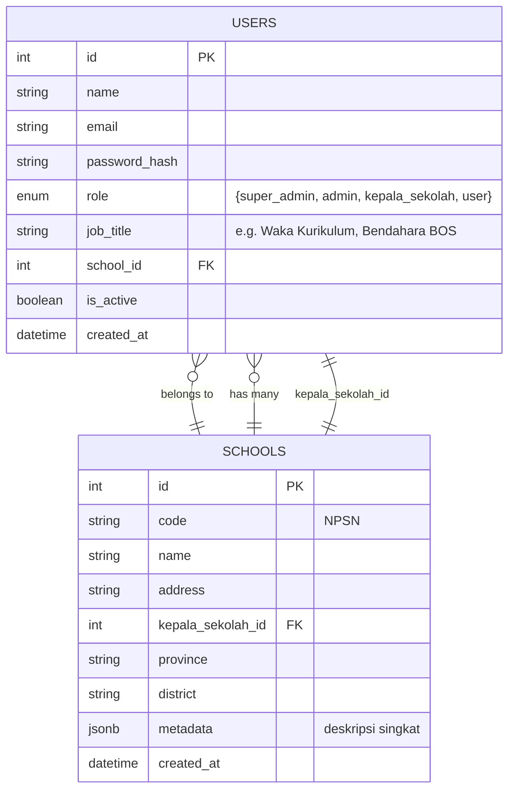

# Auth Module API Documentation

## Overview
Modul autentikasi untuk sistem SPK SAW yang menggunakan Laravel sebagai backend API dan React sebagai frontend. Modul ini menangani autentikasi pengguna, manajemen token JWT, dan operasi CRUD untuk pengguna.

## Endpoints

### Authentication Endpoints

#### Login
```
POST /api/auth/login
```
**Access Level:** All

**Description:** Autentikasi pengguna, menghasilkan token JWT

**Request Body:**
```json
{
  "email": "user@example.com",
  "password": "password123"
}
```

**Response (Success):**
```json
{
  "status": "success",
  "message": "Login successful",
  "data": {
    "user": {
      "id": 1,
      "name": "John Doe",
      "email": "user@example.com",
      "role": "admin"
    },
    "token": "eyJ0eXAiOiJKV1QiLCJhbGciOiJIUzI1NiJ9...",
    "expires_in": 3600
  }
}
```

**Response (Error):**
```json
{
  "status": "error",
  "message": "Invalid credentials",
  "errors": {
    "email": ["These credentials do not match our records."]
  }
}
```

---

#### Refresh Token
```
POST /api/auth/refresh
```
**Access Level:** All (Authenticated)

**Description:** Perbarui token (refresh token)

**Headers:**
```
Authorization: Bearer {token}
```

**Response (Success):**
```json
{
  "status": "success",
  "message": "Token refreshed successfully",
  "data": {
    "token": "eyJ0eXAiOiJKV1QiLCJhbGciOiJIUzI1NiJ9...",
    "expires_in": 3600
  }
}
```

---

#### Logout
```
POST /api/auth/logout
```
**Access Level:** All (Authenticated)

**Description:** Logout pengguna

**Headers:**
```
Authorization: Bearer {token}
```

**Response (Success):**
```json
{
  "status": "success",
  "message": "Successfully logged out"
}
```

---

### User Management Endpoints

#### Get All Users
```
GET /api/users
```
**Access Level:** super_admin

**Description:** Lihat semua pengguna

**Headers:**
```
Authorization: Bearer {token}
```

**Query Parameters:**
- `page` (optional): Nomor halaman untuk pagination
- `per_page` (optional): Jumlah item per halaman (default: 15)
- `search` (optional): Pencarian berdasarkan nama atau email
- `role` (optional): Filter berdasarkan role (super_admin, admin, kepala_sekolah, user)
- `status` (optional): Filter berdasarkan status (active, inactive)

**Response (Success):**
```json
{
  "status": "success",
  "data": {
    "users": [
      {
        "id": 1,
        "name": "John Doe",
        "email": "john@example.com",
        "role": "admin",
        "status": "active",
        "created_at": "2025-01-01T00:00:00.000000Z",
        "updated_at": "2025-01-01T00:00:00.000000Z"
      }
    ],
    "pagination": {
      "current_page": 1,
      "per_page": 15,
      "total": 50,
      "last_page": 4
    }
  }
}
```

---

#### Create New User
```
POST /api/users
```
**Access Level:** super_admin

**Description:** Tambah user baru (kepala sekolah, admin, user)

**Headers:**
```
Authorization: Bearer {token}
Content-Type: application/json
```

**Request Body:**
```json
{
  "name": "Jane Doe",
  "email": "jane@example.com",
  "password": "password123",
  "password_confirmation": "password123",
  "role": "admin"
}
```

**Available Roles:**
- `super_admin`: Super Administrator
- `admin`: Administrator
- `kepala_sekolah`: Kepala Sekolah
- `user`: Regular User

**Response (Success):**
```json
{
  "status": "success",
  "message": "User created successfully",
  "data": {
    "user": {
      "id": 2,
      "name": "Jane Doe",
      "email": "jane@example.com",
      "role": "admin",
      "status": "active",
      "created_at": "2025-01-01T00:00:00.000000Z",
      "updated_at": "2025-01-01T00:00:00.000000Z"
    }
  }
}
```

**Response (Validation Error):**
```json
{
  "status": "error",
  "message": "Validation failed",
  "errors": {
    "email": ["The email has already been taken."],
    "password": ["The password confirmation does not match."]
  }
}
```

---

#### Update User
```
PATCH /api/users/:id
```
**Access Level:** super_admin, admin

**Description:** Edit user (role, status, password reset)

**Headers:**
```
Authorization: Bearer {token}
Content-Type: application/json
```

**Request Body (All fields optional):**
```json
{
  "name": "Updated Name",
  "email": "updated@example.com",
  "role": "user",
  "status": "inactive",
  "password": "newpassword123",
  "password_confirmation": "newpassword123"
}
```

**Response (Success):**
```json
{
  "status": "success",
  "message": "User updated successfully",
  "data": {
    "user": {
      "id": 2,
      "name": "Updated Name",
      "email": "updated@example.com",
      "role": "user",
      "status": "inactive",
      "created_at": "2025-01-01T00:00:00.000000Z",
      "updated_at": "2025-01-01T12:00:00.000000Z"
    }
  }
}
```

---

#### Delete/Deactivate User
```
DELETE /api/users/:id
```
**Access Level:** super_admin

**Description:** Nonaktifkan / hapus user

**Headers:**
```
Authorization: Bearer {token}
```

**Query Parameters:**
- `force` (optional): Set to `true` untuk hard delete, default adalah soft delete (deactivate)

**Response (Success - Soft Delete):**
```json
{
  "status": "success",
  "message": "User deactivated successfully"
}
```

**Response (Success - Hard Delete):**
```json
{
  "status": "success",
  "message": "User deleted permanently"
}
```

---

## Error Responses

### Common Error Status Codes
- `400`: Bad Request - Invalid request format
- `401`: Unauthorized - Missing or invalid token
- `403`: Forbidden - Insufficient permissions
- `404`: Not Found - Resource not found
- `422`: Unprocessable Entity - Validation errors
- `500`: Internal Server Error - Server error

### Standard Error Response Format
```json
{
  "status": "error",
  "message": "Error description",
  "errors": {
    "field_name": ["Validation error message"]
  }
}
```

---

## Authentication & Authorization

### JWT Token
- Semua endpoint yang memerlukan autentikasi harus menyertakan header `Authorization: Bearer {token}`
- Token JWT memiliki masa berlaku default 1 jam (3600 detik)
- Gunakan endpoint `/api/auth/refresh` untuk memperbarui token

### Role-Based Access Control
- **super_admin**: Akses penuh ke semua endpoint
- **admin**: Dapat mengedit user tetapi tidak dapat menghapus
- **kepala_sekolah**: Akses terbatas sesuai kebutuhan
- **user**: Akses dasar sesuai kebutuhan

### Rate Limiting
- Login endpoint: 5 attempts per minute per IP
- Other endpoints: 60 requests per minute per authenticated user

---

## Database Schema

### Table: `users`

| Column         | Type        | Description |
|----------------|-------------|--------------|
| id (PK)        | UUID / INT  | Primary key |
| name           | TEXT        | User full name |
| email          | TEXT        | User email address |
| password_hash  | TEXT        | Encrypted password |
| role           | ENUM        | `{super_admin, admin, kepala_sekolah, user}` |
| job_title      | TEXT        | e.g. *Waka Kurikulum*, *Bendahara BOS* |
| school_id (FK) | UUID / INT  | Foreign key → `schools.id` |
| is_active      | BOOLEAN     | Active status |
| created_at     | TIMESTAMP   | Record creation date |

**Relationships:**
- Each `user` belongs to one `school` (`school_id` → `schools.id`).
- A `school` can have one or more `users`.

---

### Table: `schools`

| Column             | Type        | Description |
|--------------------|-------------|--------------|
| id (PK)            | UUID / INT  | Primary key |
| code (NPSN)        | TEXT        | School code (NPSN) |
| name               | TEXT        | School name |
| address            | TEXT        | School address |
| kepala_sekolah_id  | UUID / INT  | Foreign key → `users.id` |
| province           | TEXT        | Province name |
| district           | TEXT        | District name |
| metadata (JSONB)   | JSONB       | Short description or additional info |
| created_at         | TIMESTAMP   | Record creation date |

**Relationships:**
- Each `school` is led by one `kepala_sekolah` (`kepala_sekolah_id` → `users.id`).
- Each `school` can have many `users`.

---

### Relationship Summary

## Entity Relationship Diagram (Mermaid)



---

## Implementation TODO List

### 1. Database Setup

#### Migration Files
- [ ] Create `create_schools_table` migration
  - [ ] Add all columns as per schema (id, code, name, address, etc.)
  - [ ] Add indexes for performance (code, province, district)
  - [ ] Add unique constraint on NPSN code
- [ ] Create `create_users_table` migration  
  - [ ] Add all columns as per schema (id, name, email, password_hash, etc.)
  - [ ] Add foreign key constraint to schools table
  - [ ] Add indexes on email, role, school_id
  - [ ] Add unique constraint on email
- [ ] Create `add_kepala_sekolah_to_schools` migration
  - [ ] Add kepala_sekolah_id foreign key to schools table
  - [ ] Handle circular dependency between users and schools

#### Model Relationships
- [ ] Create `School` model with relationships
  - [ ] `hasMany(User::class)` - school has many users
  - [ ] `belongsTo(User::class, 'kepala_sekolah_id')` - school belongs to kepala sekolah
- [ ] Create `User` model with relationships
  - [ ] `belongsTo(School::class)` - user belongs to school
  - [ ] `hasOne(School::class, 'kepala_sekolah_id')` - user can be kepala sekolah
- [ ] Add model attributes and casting
  - [ ] Cast `is_active` to boolean
  - [ ] Cast `metadata` to array/json for schools
  - [ ] Add fillable fields
  - [ ] Add hidden fields (password_hash)

#### Seeders
- [ ] Create `SchoolSeeder`
  - [ ] Add sample schools with different provinces/districts
  - [ ] Include realistic NPSN codes
- [ ] Create `UserSeeder`
  - [ ] Create super_admin user
  - [ ] Create sample kepala sekolah, admin, and regular users
  - [ ] Assign users to schools appropriately

### 2. Authentication System

#### JWT Configuration
- [ ] Install and configure `tymon/jwt-auth` package
- [ ] Configure JWT settings in `config/jwt.php`
  - [ ] Set token expiration time (3600 seconds)
  - [ ] Configure refresh token settings
  - [ ] Set up JWT secret key
- [ ] Create custom JWT middleware
  - [ ] Validate token format
  - [ ] Handle token expiration
  - [ ] Extract user information from token

#### Authentication Controllers
- [ ] Create `AuthController`
  - [ ] `login()` method with email/password validation
  - [ ] `refresh()` method for token refresh
  - [ ] `logout()` method to invalidate token
  - [ ] `me()` method to get current user info
- [ ] Create authentication request validators
  - [ ] `LoginRequest` with email and password rules
  - [ ] Custom validation messages in Indonesian

#### Role-Based Access Control
- [ ] Create role enum or constants
- [ ] Create middleware for role checking
  - [ ] `SuperAdminMiddleware`
  - [ ] `AdminOrAboveMiddleware` 
  - [ ] `AuthenticatedMiddleware`
- [ ] Create policy classes for fine-grained permissions
  - [ ] `UserPolicy` for user management operations
  - [ ] `SchoolPolicy` for school-related operations

### 3. User Management System

#### User Controller
- [ ] Create `UserController` with all CRUD operations
  - [ ] `index()` - list users with filtering and pagination
  - [ ] `store()` - create new user
  - [ ] `show()` - get single user details
  - [ ] `update()` - update user information
  - [ ] `destroy()` - soft delete/deactivate user
- [ ] Implement query filters
  - [ ] Filter by role, status, school
  - [ ] Search by name and email
  - [ ] Pagination with configurable per_page

#### Request Validation
- [ ] Create `StoreUserRequest`
  - [ ] Validate name, email, password, role
  - [ ] Check email uniqueness
  - [ ] Validate password confirmation
  - [ ] Validate role against allowed values
- [ ] Create `UpdateUserRequest`
  - [ ] Make all fields optional
  - [ ] Validate email uniqueness (except current user)
  - [ ] Handle password updates securely

#### User Resources
- [ ] Create `UserResource` for API responses
  - [ ] Format user data consistently
  - [ ] Include school information when relevant
  - [ ] Hide sensitive information (password_hash)
- [ ] Create `UserCollection` for paginated responses

### 4. API Routes and Security

#### Route Definition
- [ ] Define authentication routes in `routes/api.php`
  - [ ] POST `/api/auth/login`
  - [ ] POST `/api/auth/refresh` 
  - [ ] POST `/api/auth/logout`
- [ ] Define user management routes
  - [ ] Resource routes for `/api/users`
  - [ ] Apply appropriate middleware to each route
- [ ] Group routes with middleware
  - [ ] Apply JWT middleware to protected routes
  - [ ] Apply role middleware where needed

#### Rate Limiting
- [ ] Configure rate limiting in `RouteServiceProvider`
  - [ ] 5 attempts per minute for login
  - [ ] 60 requests per minute for authenticated users
- [ ] Create custom rate limiting for sensitive operations
- [ ] Add rate limiting middleware to routes

#### Security Headers
- [ ] Configure CORS properly for React frontend
- [ ] Add security headers middleware
- [ ] Configure CSRF protection exemptions for API routes

### 5. Error Handling and Logging

#### Exception Handling
- [ ] Create custom exception classes
  - [ ] `InvalidCredentialsException`
  - [ ] `TokenExpiredException`
  - [ ] `InsufficientPermissionsException`
- [ ] Update `app/Exceptions/Handler.php`
  - [ ] Handle JWT exceptions
  - [ ] Format API error responses consistently
  - [ ] Log security-related errors

#### Validation and Error Messages
- [ ] Create custom validation rules if needed
- [ ] Translate error messages to Indonesian
- [ ] Ensure consistent error response format across all endpoints

### 6. Frontend Integration (React)

#### Authentication Context
- [ ] Create `AuthContext` for managing auth state
- [ ] Create `AuthProvider` component
- [ ] Implement token storage (localStorage/sessionStorage)
- [ ] Handle token refresh automatically

#### API Service Layer
- [ ] Create `authService.js` for authentication API calls
- [ ] Create `userService.js` for user management API calls
- [ ] Implement axios interceptors for token handling
- [ ] Handle API errors consistently

#### Protected Routes
- [ ] Create `ProtectedRoute` component
- [ ] Implement role-based route protection
- [ ] Create route guards for different user roles
- [ ] Handle unauthorized access gracefully

#### UI Components
- [ ] Create login form component
- [ ] Create user management interface
- [ ] Create user creation/editing forms
- [ ] Implement proper form validation
- [ ] Add loading states and error handling

### 7. Testing

#### Backend Tests
- [ ] Create feature tests for authentication endpoints
  - [ ] Test login with valid/invalid credentials
  - [ ] Test token refresh functionality
  - [ ] Test logout functionality
- [ ] Create feature tests for user management
  - [ ] Test CRUD operations with different roles
  - [ ] Test validation rules
  - [ ] Test authorization policies
- [ ] Create unit tests for models and relationships
- [ ] Create unit tests for custom middleware and policies

#### Frontend Tests
- [ ] Create tests for authentication context
- [ ] Create tests for API service functions
- [ ] Create tests for protected routes
- [ ] Create tests for form validation

### 8. Documentation and Deployment

#### API Documentation
- [ ] Set up Swagger/OpenAPI documentation
- [ ] Document all endpoints with examples
- [ ] Include authentication requirements
- [ ] Add example requests and responses

#### Environment Setup
- [ ] Configure environment variables for JWT
- [ ] Set up database configuration
- [ ] Configure mail settings for password resets
- [ ] Set up logging configuration

#### Performance Optimization
- [ ] Add database indexes for better query performance
- [ ] Implement caching for frequently accessed data
- [ ] Optimize API response sizes
- [ ] Add database query optimization

### 9. Security Enhancements

#### Additional Security Features
- [ ] Implement password reset functionality
- [ ] Add email verification for new users
- [ ] Implement account lockout after failed attempts
- [ ] Add audit logging for user actions
- [ ] Implement session management
- [ ] Add two-factor authentication (optional)

#### Data Validation
- [ ] Implement input sanitization
- [ ] Add XSS protection
- [ ] Validate file uploads if applicable
- [ ] Implement SQL injection prevention

### 10. Monitoring and Maintenance

#### Logging and Monitoring
- [ ] Set up comprehensive logging
- [ ] Monitor authentication failures
- [ ] Track API usage and performance
- [ ] Set up alerts for security incidents

#### Backup and Recovery
- [ ] Implement database backup strategy
- [ ] Create data migration scripts
- [ ] Test disaster recovery procedures

---

## Implementation Priority

### Phase 1 (Critical - Week 1-2)
1. Database setup (migrations, models, relationships)
2. Basic JWT authentication (login, logout, refresh)
3. User management CRUD operations
4. Basic role-based access control

### Phase 2 (Important - Week 3-4)
1. Frontend authentication context
2. Protected routes and role guards
3. User management UI
4. Comprehensive testing
5. Error handling and validation

### Phase 3 (Enhancement - Week 5-6)
1. Advanced security features
2. Performance optimization
3. Comprehensive documentation
4. Monitoring and logging
5. Deployment preparation

---

## Notes
- Semua response menggunakan format JSON
- Timestamps menggunakan format ISO 8601 (UTC)
- Pagination menggunakan sistem offset-based dengan parameter `page` dan `per_page`
- Password harus minimal 8 karakter
- Email harus unique dalam sistem